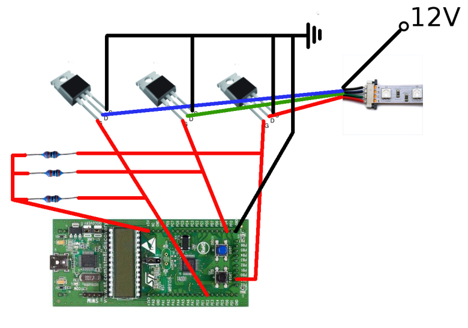

This code works with STM8L-DISCOVERY and
[libstm8](https://github.com/mnd/libstm8) library.

PD2, PD5 and PD6 used to generate PWM for selecting colors of RGB LED tape. PC2
connected to TX pin of computer COM port. Color can be changed with setcolor.sh
script.

Electrical circuit with 10 kOm resistors and irf630 MOSFET's:

No one must ever use this circuit. irf630 mosfet has 4V threshold gate voltage,
so we can't use regular GPIO output that give only 3V, so I choose open drain
mode and 5V pull-up. According to documentation 5V tolerant pins is PA7, PC0,
PC1 and PE0, but no one of this pins connected to timers output and PWM on this
pins must be created manually. Instead I use TIM1_CH1, TIM1_CH2, TIM1_CH3N pins
(TIM1_CH3N instead of TIM1_CH3 used because TIM1_CH3 pin can't perform PWM open
drain mode) that only 3.6V tolerant, so I can burn controller in any second.

Next step would be creating functions in
[libstm8](https://github.com/mnd/libstm8) to configure timers, so that I take
possibility to remove all this set-bits-in-registers code.
